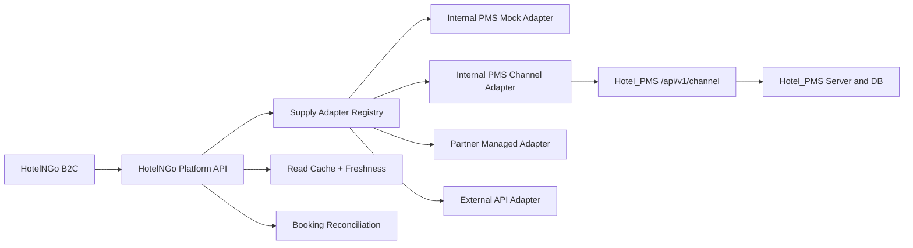
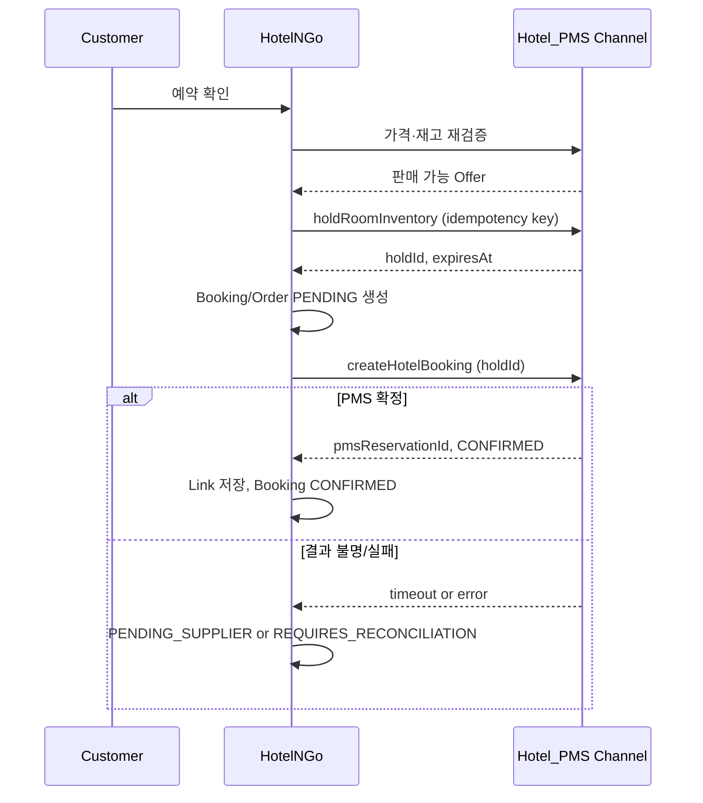

# HotelNGo ↔ Hotel_PMS 연동 실행 가이드

## 1. 결정사항

- `E:\AI_Project\Hotel_PMS`를 HotelNGo의 `INTERNAL_PMS` 원천 시스템으로 사용한다.
- HotelNGo와 Hotel_PMS는 별도 애플리케이션·저장소·배포 단위로 유지한다.
- HotelNGo는 PMS JSON 파일, 브라우저 `localStorage`, 화면 DOM을 런타임에 직접 읽지 않는다.
- 모든 호텔 공급은 `HotelSupplyAdapter` 계약을 통과한다.
- Release 1은 독립 fixture 기반 읽기 전용 Mock이며, 실연동 완료로 간주하지 않는다.
- Hotel_PMS의 기존 예약 UI·저장 로직·테이블을 Release 1에서 수정하지 않는다.

## 2. 현재 PMS에서 코드로 확인된 사실

| 구분 | 확인 내용 | 연동 영향 |
|---|---|---|
| 실행 구조 | 정적 HTML/CSS/JavaScript | 서버 간 인증/API 호출 불가 |
| API | `PmsMockApi`가 `/api/v1/*` 요청을 fixture JSON으로 매핑 | 브라우저 내부 Mock 계약일 뿐 채널 API가 아님 |
| 쓰기 | 브라우저 `localStorage`에 저장 | 다중 사용자·트랜잭션·원자적 홀드 불가 |
| 테넌트 | `TENANT-GRAND-SAIGON` 중심의 하드코딩 | 요청별 안전한 테넌트 식별 불가 |
| 핵심 흐름 | Tenant → RoomType/Room → Reservation → Guest → Folio | 공개 모델의 기준 매핑으로 활용 가능 |
| 요금/재고 | fixture와 화면 로직에 분산 | 모든 숙박일을 포괄하는 신뢰 가능한 원천 API 필요 |
| 인증 | 실서버 토큰/서비스 인증 없음 | 실연동 전 채널 인증 설계 필요 |
| 서버 진입점 | `package.json`의 `server.js` 참조와 실제 파일 불일치 | 현재 저장소를 운영 API 서버로 간주할 수 없음 |

추가로 확인된 정합성 위험은 객실유형 코드(`DLX-CITY`, `DLX-OCEAN`, `DLX`) 불일치, 요금/가용성 날짜 범위의 희소성, 호찌민 호텔과 `Asia/Seoul` 시간대 조합, 세금·취소·최소숙박·CTA/CTD·미디어 정보 부족, 버전 표기 혼재다. 이 항목은 실연동 전에 데이터 정비 또는 명시적 변환 규칙이 필요하다.

## 3. 목표 연동 구조



어댑터 레지스트리는 호텔의 `supplierType/supplierId`로 구현을 선택한다. B2C와 예약 오케스트레이터는 공급 방식에 따른 분기 로직을 갖지 않는다.

## 4. 표준 매핑

| Hotel_PMS | HotelNGo | 공개 여부/규칙 |
|---|---|---|
| Tenant | Provider + 공개 Hotel Place | 공개 승인된 호텔 정보만 |
| RoomType | Hotel RoomProduct | 판매 단위; 코드는 매핑 테이블 사용 |
| Room | 물리 재고 계산 근거 | ID/호실번호 공개 금지 |
| 요금 캘린더 | 날짜별 Rate/Offer 입력 | 세금·통화·식사·취소 조건 명시 |
| 객실 상태 | 객실유형별 가용수량 입력 | 점검/사용중/차단은 제외 |
| Reservation | 재고 차감 및 SupplierBooking | HotelNGo Booking과 별도 보관 |
| Guest | 예약 수행에 필요한 최소 고객정보 | 목적 제한·암호화·마스킹 |
| Folio | PMS 정산/체류 원장 | 공개·검색·RAG에서 제외 |

객실유형의 가용 수량은 요청한 모든 숙박일에 대해 판매 가능한 물리 객실의 교집합을 기준으로 한다. 점검, 사용중, 판매중지, 중복 예약 기간의 객실은 제외한다. 체크아웃일은 점유 종료일로 처리하되 PMS 정의와 계약 테스트로 확정한다.

## 5. 어댑터 계약과 정규화

`HotelSupplyAdapter`의 전체 메서드는 `04-api-plan.md`를 따른다. Release 1에서 활성화되는 메서드는 다음 네 가지다.

- `searchHotels`
- `getHotelDetail`
- `getRoomAvailability`
- `getRoomRates`

쓰기 메서드는 `UNSUPPORTED_OPERATION`을 반환한다. 조회 DTO는 최소 다음을 보장한다.

```json
{
  "supplierId": "internal-pms-grand-saigon",
  "supplierType": "INTERNAL_PMS",
  "hotelId": "opaque-hotel-id",
  "roomProductId": "opaque-room-type-id",
  "stay": { "checkIn": "2026-10-10", "checkOut": "2026-10-12" },
  "occupancy": { "adults": 2, "children": 0, "rooms": 1 },
  "price": {
    "total": { "amount": "240000", "currency": "KRW" },
    "taxIncluded": true
  },
  "cancellationPolicy": { "code": "NON_REFUNDABLE", "summary": "..." },
  "availableQuantity": 2,
  "verifiedAt": "2026-07-21T03:00:00Z",
  "freshnessStatus": "FRESH"
}
```

요금과 재고의 키는 `supplierId + hotelId + roomProductId + stayDate + occupancy/ratePlan`을 기준으로 정규화한다. 알 수 없는 세금/취소조건을 임의 기본값으로 채워 판매하지 않는다.

## 6. Release 1: 독립 Mock 연동

### 6.1 구현

- HotelNGo 저장소에 공개 가능한 호텔·객실유형·날짜별 요금·재고 fixture를 둔다.
- fixture는 PMS의 개념과 일부 샘플 값을 재현하되 `E:\AI_Project\Hotel_PMS` 파일을 런타임 import하지 않는다.
- Mock 어댑터와 B2C 프런트 서비스는 실제 어댑터와 같은 TypeScript/JavaScript 계약과 오류 코드를 사용한다.
- 검색 → 상세 → 객실/요금의 단일 수직 슬라이스를 완성한다.
- PMS 미응답, 부분 데이터, 매진, 오래된 데이터 fixture를 별도 시나리오로 둔다.

### 6.2 완료 기준

- 호텔 검색, 상세, 객실유형별 요금/재고가 동일 계약으로 표시된다.
- 다른 tenant fixture가 검색·상세·자동완성·로그에 노출되지 않는다.
- 물리 호실 ID가 브라우저 응답과 화면에 없다.
- 전 일정 가격/재고가 없으면 판매 가능으로 표시하지 않는다.
- Hotel_PMS의 예약 fixture/localStorage가 변경되지 않는다.

## 7. Release 2~3: 실제 채널 API

Hotel_PMS에 실제 서버·DB가 준비되면 운영자용 내부 API와 별도의 채널 API를 제공한다.

### 7.1 읽기 API

| Method | PMS 경로 | 목적 |
|---|---|---|
| GET | `/api/v1/channel/property` | 테넌트의 공개 호텔 정보 |
| GET | `/api/v1/channel/room-products` | 공개 판매 객실유형 |
| GET | `/api/v1/channel/offers` | 날짜범위·인원별 요금과 가용수량의 일관된 스냅샷 |
| GET | `/api/v1/channel/health` | 인증/버전/의존성 상태; 업무 데이터 미포함 |

별도 `rates`와 `availability`를 호출해 조합하는 경우 서로 다른 시점의 데이터가 될 수 있으므로, 공개 판매 판단에는 `offers` 스냅샷을 우선한다.

### 7.2 채널 보호

- 서비스 인증: mTLS 또는 짧은 수명의 서명 토큰
- 토큰 클레임/헤더의 `tenantId`와 경로 리소스의 tenant 일치 검증
- IP/서비스/테넌트별 호출 제한, 자격증명 회전, 최소권한
- `traceId`, `supplierRequestId`, 계약 버전, 응답 생성시각 기록
- 개인정보 최소화, 전송/저장 암호화, 로그 마스킹
- 내부 운영 API와 네트워크/라우트/권한 분리

### 7.3 캐시와 신뢰 상태

HotelNGo 읽기 캐시는 성능/장애 완화를 위한 복제본이며 PMS가 원천이다. 캐시 레코드에 `sourceVersion`, `verifiedAt`, `expiresAt`, `freshnessStatus(FRESH/STALE/UNKNOWN)`를 저장한다.

- 호텔 공개정보는 상대적으로 긴 TTL을 허용한다.
- 요금/재고는 짧은 TTL과 예약 직전 강제 재검증을 적용한다.
- TTL을 넘긴 데이터는 참고로 표시할 수 있어도 예약 가능 재고로 사용하지 않는다.
- PMS 타임아웃 때 기존 캐시를 새 데이터처럼 보이게 만들지 않는다.

### 7.4 Shadow 전환 게이트

1. 단일 테스트 호텔을 연결하되 B2C에는 Mock 결과를 유지한다.
2. 같은 질의를 Mock/PMS 화면/채널 API에 실행하고 객실유형·총액·재고·정책을 비교한다.
3. 최소 7일 또는 1,000개 유효 질의 중 늦게 충족되는 기준까지 관찰한다.
4. 유효 응답률 99.5% 이상, p95 750ms 이하, 허위 판매가능 재고 0건, 가격/재고 차이의 원인 100% 분류를 통과한다.
5. 기능 플래그로 내부 사용자 → 소수 트래픽 → 전체 트래픽 순서로 전환한다.
6. 오류율/불일치 임계 초과 시 Mock이 아닌 ‘조회 불가/예약 차단’으로 안전 복귀한다.

## 8. 예약 생성·변경·취소

### 8.1 엔티티 분리

- HotelNGo `Booking`: 고객·주문 관점의 예약
- PMS `Reservation`: PMS 원천의 객실 운영 예약
- `PmsReservationLink`: `bookingId`, `supplierId`, `pmsReservationId`, 상태, 마지막 대사시각, 버전

한쪽 ID를 다른 쪽의 주키로 사용하지 않는다.

### 8.2 생성 흐름



- 홀드 기본 만료는 10분으로 시작하고 PMS/결제 지연 관측 후 조정한다.
- 같은 멱등성 키와 같은 payload는 같은 결과를 반환하고, 다른 payload면 `IDEMPOTENCY_CONFLICT`다.
- PMS 예약 생성 성공을 확인하지 못하면 HotelNGo를 확정으로 표시하지 않는다.
- 결제 승인과 PMS 확정 순서/보상은 결제수단별로 결정하되 ‘돈만 받고 예약 없음’을 자동 확정으로 숨기지 않는다.

### 8.3 변경·취소

- 변경은 새 가격·정책·재고를 먼저 조회하고 고객의 차액/정책 동의를 받는다.
- 취소는 PMS 응답의 취소번호/상태를 저장하고 최종 상태를 재조회한다.
- 공급자 결과가 불명확하면 자동 환불/확정을 단정하지 않고 대사 상태로 둔다.
- 예약·결제·환불의 보상 흐름은 각각 독립적으로 재시도 가능해야 한다.

## 9. 대사와 수동 복구

- 실시간 재시도는 지수 백오프와 최대 횟수를 두고, 그 이후에는 작업 큐로 이관한다.
- 주기 대사는 HotelNGo 예약과 PMS 예약의 존재·상태·금액·숙박일·객실유형을 비교한다.
- 불일치는 원인, 마지막 성공 단계, 권장 작업과 함께 운영 화면에 표시한다.
- 수동 연결/해제/재시도/취소는 제한 권한, 사유, 2차 확인, 감사로그가 필요하다.
- 동일 공급자 장애 시 회로 차단기를 열고 새 예약을 차단하되 이미 생성된 건의 상태조회/대사는 별도 우선순위로 유지한다.

## 10. 다른 공급 방식 확장

`PARTNER_MANAGED`는 HotelNGo 파트너 도메인의 RoomProduct/Offer/Inventory/Booking을 사용하되 같은 어댑터를 구현한다. 외부 PMS·채널매니저는 별도 어댑터를 만들고 계약 테스트를 동일하게 통과해야 한다. `HYBRID_MANAGED`는 공개정보의 필드별 원천과 거래 원천을 명시하며, 동일 필드에 복수 원천이 있을 때 우선순위와 최신성 규칙을 고정한다.

## 11. 실연동 착수 전 필수 선행조건

- Hotel_PMS의 운영 서버/API/DB와 트랜잭션 경계
- 테넌트별 서비스 인증·권한·감사로그
- 객실유형 안정 ID와 매핑 정비
- 전 일정 요금/재고를 원자적으로 판단하는 API
- 세금, 통화, 취소, 식사, 최소숙박, CTA/CTD 등 판매정책 정의
- 홀드와 멱등 예약 명령, 상태조회, 취소/변경, 장애 재처리
- 시간대와 영업일/체크인·체크아웃 날짜 의미 확정
- 계약 테스트용 비운영 테넌트와 개인정보 없는 fixture

이 조건이 갖춰지기 전에는 HotelNGo 예약 쓰기를 PMS에 연결하지 않는다.
## 12. Guest 매핑 원칙

HotelnGo `Member`를 PMS `Guest`로 가져오거나 PMS 계정으로 로그인시키지 않는다. 예약 시점에는 선택된 `TravelerProfile`의 최소 스냅샷만 채널 API로 보낸다. PMS가 기존 고객을 식별하더라도 결과는 호텔·테넌트 범위의 `PmsGuestLink`로 저장하고 HotelnGo 계정 ID와 PMS 고객 ID를 병합하지 않는다.
