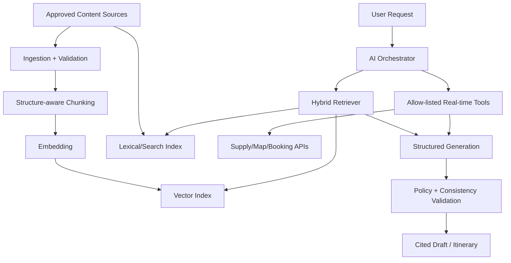

# HotelNGo AI·RAG 구현 명세

## 1. 목적과 경계

AI는 여행자의 조건을 구조화하고, 근거가 있는 콘텐츠와 실시간 공급 데이터를 조합해 일정/상품 후보를 설명하는 보조 계층이다. AI가 가격·재고·예약 상태의 원천이 되거나 결제/예약을 임의 실행해서는 안 된다.

Release 6에서 RAG 검색 기반을 먼저 안정화하고 Release 7에서 대화형 일정 생성과 자동화 범위를 확대한다.

## 2. RAG 대상과 비대상

### 2.1 인덱싱 대상

- 승인·발행된 여행 스토리와 블록
- 검증된 랜드마크/장소 설명, 운영 팁, 접근성, 정책
- 호텔/업종별 공개 설명, 편의/포함사항, 취소/이용 정책
- 고객지원 지식, 이용약관의 검색 허용 부분
- 운영자가 승인한 파트너 콘텐츠와 번역본

각 청크는 `sourceType/sourceId/version/language/region/category/publishStatus/verifiedAt/validFrom/validTo/visibility` 메타데이터를 가진다.

### 2.2 인덱싱 금지 또는 실시간 조회 대상

- 호텔·업종별 현재 가격, 재고, 티타임, 회차, 좌석
- 홀드 만료, 예약·결제·환불·정산 상태
- 고객 개인정보, 투숙객 정보, 다른 사용자의 일정
- PMS 직원·물리 호실·Folio·내부 메모
- 미승인 초안, 삭제/회수된 콘텐츠

가격·재고·예약 상태는 항상 어댑터/거래 API를 실시간 호출한다. 벡터 검색 결과의 숫자를 판매 확정값으로 사용하지 않는다.

## 3. 구성요소

## 4. 수집·청킹·인덱싱

1. 원천의 발행/공개/검증 상태와 권한을 검사한다.
2. 스토리의 블록, 정책의 조항, 장소의 의미 필드 단위로 구조 인식 청킹한다.
3. 제목·지역·업종·시간/계절·대상·언어 메타데이터를 정규화한다.
4. 개인정보/비밀정보 탐지와 금칙 원천 검사를 수행한다.
5. 임베딩과 키워드 인덱스를 생성하고 원천 버전과 연결한다.
6. 원천 수정/회수/삭제 시 해당 버전 청크를 비활성화 또는 삭제한다.
7. 색인 작업의 성공/실패/지연과 원천 대비 누락을 모니터링한다.

벡터에는 원문 전체가 아니라 허용된 청크와 참조 키를 저장한다. 검색 결과는 항상 원천 문서·블록으로 역추적 가능해야 한다.

## 5. 하이브리드 검색

검색은 의미 유사도와 키워드/필터 검색을 함께 사용한다.

- 필수 필터: 공개상태, 언어/대체언어, 지역, 카테고리, 유효기간, 사용자 가시성
- 선택 필터: 여행 기간, 동행 유형, 예산대, 접근성, 실내/야외, 계절/날씨 적합성
- 재순위: 질의 적합도, 출처 신뢰도, 최신성, 다양성, 중복 억제
- 근거 부족: 임의 생성 대신 조건 완화 제안 또는 확인 필요 표시

검색 결과에는 `sourceId`, 제목, 관련 구간, 버전, 확인시각, 점수가 포함되며 사용자에게는 읽기 쉬운 출처 링크/근거 요약을 제공한다.

## 6. 대화형 일정 생성 입력/출력

### 6.1 구조화 입력

- 목적지/지역, 출도착 일시, 숙소 위치 또는 후보
- 인원, 연령대, 동행 유형, 이동수단
- 총예산/통화와 업종별 예산 선호
- 관심사, 반드시 포함/제외할 항목
- 식사·알레르기·접근성·휴식/보행 선호
- 예약 완료 항목과 변경 불가 시간
- 언어, 시간대, 날씨/운영시간 고려 여부

### 6.2 구조화 출력

- 날짜별 일정 항목: 시작/종료, 장소/상품 참조, 이동, 예상비용, 예약필요 여부
- 추천 이유와 근거 출처
- 가격/재고 확인시각과 신뢰 상태
- 시간 충돌, 운영시간, 이동시간, 예산, 연령/접근성, 취소정책 경고
- 대체안과 사용자가 결정해야 할 항목

출력은 JSON Schema로 먼저 검증한 뒤 UI 모델로 변환한다. 자유 텍스트에서 예약 ID나 가격을 파싱해 거래에 사용하지 않는다.

## 7. 허용 도구

AI 오케스트레이터가 호출할 수 있는 내부 도구는 다음으로 제한한다.

| 도구 | 권한/결과 |
|---|---|
| `search_places` | 공개·검증된 장소 후보 |
| `search_stories` | 발행된 스토리와 근거 |
| `search_products` | 업종별 공개 상품 후보 |
| `get_live_offers` | 날짜/인원별 실시간 가격·재고; 공급 신뢰상태 포함 |
| `get_travel_time` | 출도착·교통수단별 이동시간 |
| `validate_itinerary` | 시간/운영/이동/예산/예약 충돌 |
| `draft_cart` | 장바구니 후보만 작성; 구매 실행 금지 |
| `reprice_cart` | 최신 가격/재고와 변경사항 반환 |
| `get_booking_status` | 현재 사용자의 예약 상태만 |

결제, 환불, 예약 생성/취소 같은 쓰기 도구는 AI에 직접 개방하지 않는다. 향후 개방 시에도 별도 사용자 확인 토큰, 제한된 payload, 멱등 키, 일반 API의 모든 정책을 적용한다.

## 8. 생성형 스토리

- AI는 제목, 개요, 블록 초안, 태그, 연결 장소 후보를 생성할 수 있다.
- 장소/상품 연결은 자유 텍스트 이름이 아니라 실제 공개 엔티티 ID를 검증해 저장한다.
- 근거 없이 영업시간·가격·안전·비자/법률·건강 정보를 단정하지 않는다.
- AI 생성 여부, 모델/프롬프트 버전, 사용 근거, 편집 이력을 저장한다.
- 기본 상태는 `DRAFT`이며 편집자 검토 후 `PUBLISHED`로 전환한다.
- 원천이 회수되거나 중요 사실이 변경되면 재검토 큐에 넣는다.

## 9. 보안과 안전

- 사용자/파트너 콘텐츠의 프롬프트 인젝션 문구를 명령으로 취급하지 않는다.
- 시스템 프롬프트, 자격증명, 비공개 도구 결과를 모델 출력에 포함하지 않는다.
- 도구는 서버가 만든 허용 목록과 JSON Schema를 사용하고 URL/SQL/임의 코드를 모델이 직접 실행하지 못한다.
- 사용자별 데이터 범위를 각 도구에서 재검사한다.
- 민감정보는 모델 입력 전 최소화/마스킹하며 보존기간과 모델 제공자 정책을 기록한다.
- 아동, 장애 접근성, 안전, 환불/정책처럼 영향이 큰 정보는 원천/확인시각과 불확실성을 표시한다.

## 10. 평가 기준

### 10.1 오프라인 평가 세트

- 지역/기간/예산/동행/접근성 조합의 대표 여행 질의
- 존재하지 않는 장소/가격 유도, 오래된 정책, 다국어, 모호한 목적지
- 프롬프트 인젝션, 다른 사용자 예약 탐색, 내부정보 요구
- 운영시간·이동시간·예산·중복일정 충돌

### 10.2 지표

- 검색: Recall@K, nDCG, 출처 다양성, 폐기 원천 노출 0건
- 답변: 근거 포함률, 인용 정확성, 사실오류/환각률
- 일정: 시간/이동/운영시간/예산 제약 통과율
- 거래: 실시간 재검증 누락 0건, AI 직접 예약/결제 0건
- 운영: 응답 지연, 도구 실패율, 토큰/비용, 사용자 수정률, 신고율

## 11. 운영과 버전관리

- 실행마다 모델, 프롬프트, 도구, 인덱스, 원천 버전을 기록한다.
- 프롬프트/검색 파라미터 변경은 평가 세트와 회귀 기준을 통과해야 한다.
- 오류율/신고/비용 임계치를 넘으면 AI 기능 플래그를 끄고 일반 검색·수동 일정으로 복귀한다.
- 사용자는 AI 추천의 근거와 최신 확인시각을 볼 수 있고, 잘못된 정보 신고와 수정 피드백을 보낼 수 있어야 한다.

